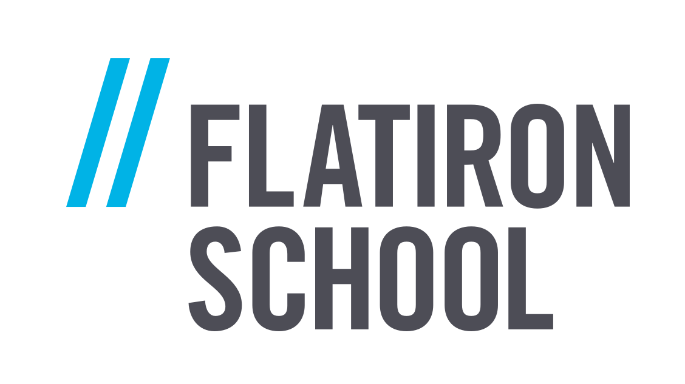

# Movie Industry Data Analysis

I've been given the following scenario for my Flatiron School Module 1 Project: Microsoft has decided to enter the movie industry by creating its own movie studio, and has hired me to help them understand the industry. It's my task to do data analysis and present actionable insights to the company.

## Getting Started
### Contents of Repository

* **data-manipulation-and-visualization.ipynb** is a Jupyter Notebook containing all my analysis and visualizations for the project.
* **presentation.pdf** contains my powerpoint presentation for a non-technical audience.
* **Data** is a directory containing:
  * **flatiron_data** contains all data provided by Flatiron School as CSV files. Data comes from IMDB, Rotten Tomatoes, and TMDB.
  * **kaggle_the_movies_dataset** contains all data from Kaggle's [The Movies Dataset](https://www.kaggle.com/rounakbanik/the-movies-dataset) as CSV files.
  * **tmdb_keyword_data.csv** is a backup file of data I got from TMDB on keyword data, originally produced in my Jupyter Notebook.
* **Images** is a directory containing images used in this README.

### Prerequisites

The standard packages for data analysis are required–NumPy, Pandas, and Matplotlib–as well as Plotly and Cufflinks for visualizations. Below are examples of their installations using Anaconda for all but Matplotlib, for which Brew is used.

```
$ conda install -c anaconda numpy
$ conda install pandas
$ conda install -c conda-forge matplotlib
$ conda install -c plotly plotly
$ conda install -c conda-forge cufflinks-py
```

## Built With

[Jupyter Notebook](https://jupyter.org) - Documents containing live code and visualizations.

## Contributing

Due to the nature of the assignment, this project is not open to contributions. If, however, after looking at the project you'd like to give advice to someone new to the field and eager to learn, please reach out to me at [stephen.t.lanier@gmail.com]

## Author

**Stephen Lanier** <br/>
[GitHub](https://github.com/stlanier) <br/>
[Datalingo](https://datalingo.wordpress.com)


## Acknowledgments

<a href="https://flatironschool.com"></a>
Special thanks to Jacob Eli Thomas and Victor Geislinger, my instructors at [Flatiron School](https://flatironschool.com), for their encouragement, instruction, and guidance.

<a href="https://www.themoviedb.org/?language=en-US"></a>
Thanks to [The Movie Database](https://www.themoviedb.org/?language=en-US) for the use of their data.

<a href="https://www.kaggle.com"></a>
Thanks to [Kaggle](https://www.kaggle.com) for access to [The Movies Dataset](https://www.kaggle.com/rounakbanik/the-movies-dataset)
